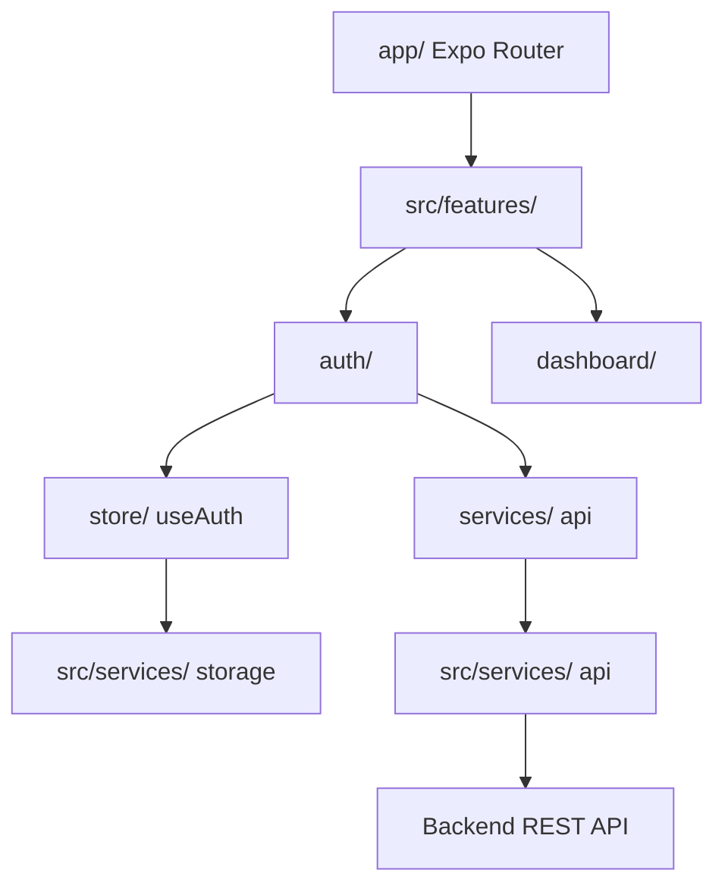

# 🚀 Premium React Native Expo Boilerplate (CLI Scaffold)

A production-grade, highly scalable mobile architecture template using **Expo**, **Expo Router**, **TypeScript**, and **Zustand** (with Redux Toolkit support).

Designed strictly under **Feature-Based Modular Slice Architecture** and built with elite developer tooling (**Biome** linter/formatter, **Husky** hooks, and **Semantic Commits** validator).

## 🛠️ Tech Stack & Elite Tooling
- **Core Framework**: Expo SDK & React Native.
- **Routing & Navigation**: Expo Router (file-based navigation with tab templates).
- **Fast Linting/Formatting**: Biome (`biome.json`). 100x faster than Prettier/ESLint.
- **Git Hooks Automations**: Husky (`.husky/pre-commit` and `commit-msg`).
- **State Management**: Zustand (lightweight) or Redux Toolkit (enterprise).
- **Commit Linting**: Automated Conventional Commit validation before committing.

## 📦 Custom Scaffolder CLI (Quick Start)
You can instantly scaffold a new app with this architecture by running our executable CLI:

```bash
# Initialize a new app
npx react-native-expo-boilerplate my-awesome-app
```
During initialization, the CLI will ask whether you want to use **Zustand** or **Redux Toolkit** and configure the dependencies and folders accordingly.

---

## 🏗️ Architectural Overview (Feature-Based Modular Slice)

This project uses a modular slice-based structure where features are isolated, self-contained directories. Each feature contains its own local presentation components, state stores, services, and hooks.

```
src/
├── components/          # Global Atomic reusable UI Components (Button, Input)
├── features/            # Feature Modular Slices
│   ├── auth/            # Self-contained Authentication slice
│   │   ├── components/  # Auth-only specific views
│   │   ├── services/    # Auth API endpoints requests
│   │   └── store/       # State management slice (Zustand/Redux)
│   └── dashboard/       
├── services/            # Shared Global Services (Secure Storage, Axios client)
└── theme/               # Centralized style theme tokens (colors, spacing)
```

### Flow Architecture


